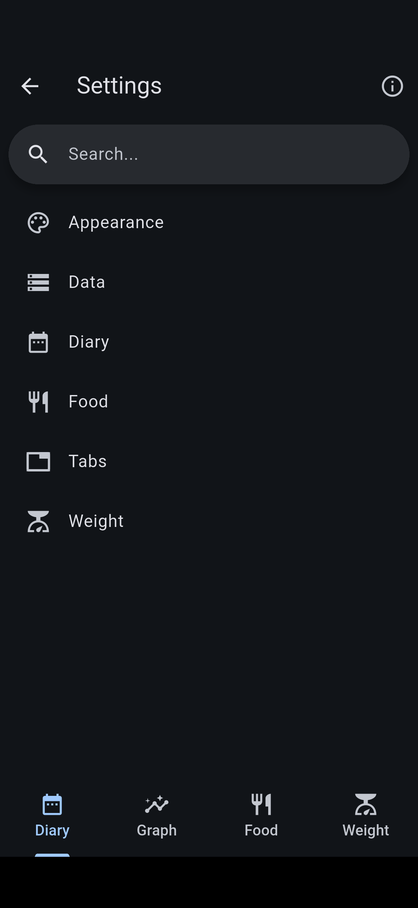

# FitBook

**FitBook** is a Flutter application designed to help you keep track of your daily calorie intake. It works offline and provides a visual representation of your calorie consumption through easy-to-understand graphs.

## Features

- **Offline Calorie Tracking**: Log your meals and snacks with ease, even without an internet connection. Our app will keep track of the calories you consume throughout the day.

- **Graphical Representation**: Visualize your calorie intake over time with our built-in graph feature. This can help you understand your eating habits better and make necessary adjustments.

## Screenshots

    
    
    
    

## Installation

To install the app, follow these steps:

1. Clone the repository: `git clone https://github.com/brandonp2412/FitBook`
2. Navigate into the project directory: `cd FitBook`
3. Install dependencies: `flutter pub get`
4. Run the app: `flutter run`

## Usage

After launching the app, you can start adding your meals and snacks for the day. The app will automatically calculate and display your total calorie intake. You can also view your calorie consumption over time in the 'Graphs' section.

## Contributing

Contributions are welcome! Please read our Contributing Guide for more information.

## License

This project is licensed under the MIT License - see the LICENSE file for details.