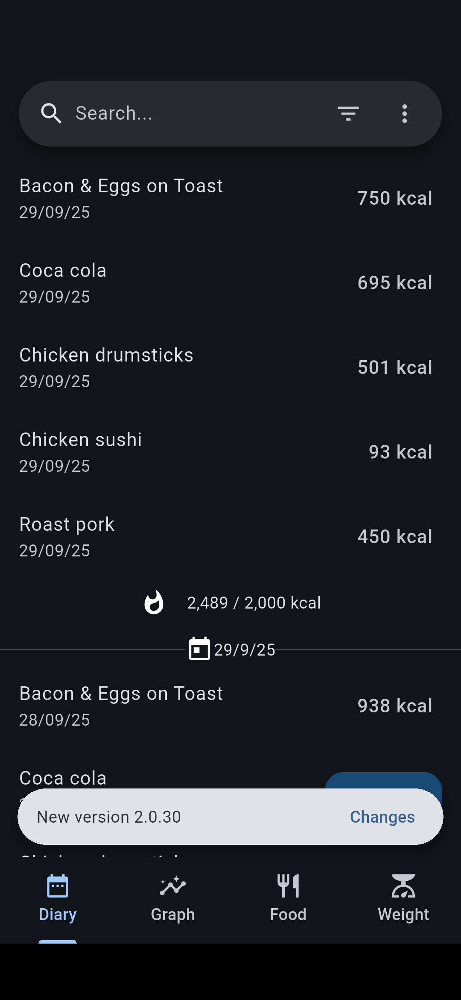
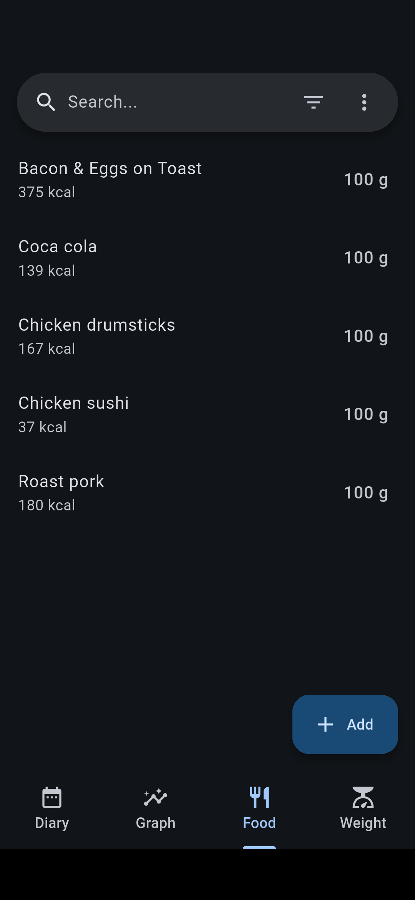
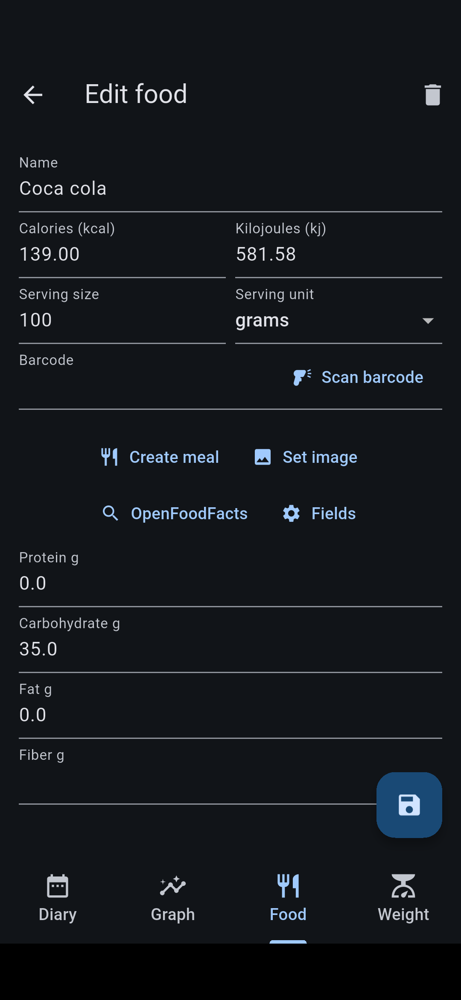

# FitBook

Graph your eating habits with ease!

    
    

# Features

- 🔌 **Offline**: Internet is completely optional.
- 🍏 **Foods**: FitBook ships with over 7 thousand foods (sourced from the [CORGIS Dataset Project](https://corgis-edu.github.io/corgis/csv/food/)).
- 🍇 **OpenFoodFacts**: Scan barcodes & search for foods with [OpenFoodFacts](https://world.openfoodfacts.org/).
- 📈 **Graphs**: Plot your diet macros over time.

# Screenshots

    
    
    
    
    
    
    
    

# Donations

Contributing to this project helps us keep adding awesome features!

- Bitcoin `bc1qzlte8featxzf7xvtp3rjv7qqtwkgpup8hu85gp`
- Monero (XMR) `85tmLfWKbpd8nxQnUY878DDuFjmfcoCFXPWR7XYKLHBSbDZV8wxgoKYUtHtq1kHWJg4m14sdBXhYuUSbxEDA29d19XuREL5`
- [GitHub sponsor](https://github.com/sponsors/brandonp2412)

# Installation

To install the app, follow these steps:

1. Clone the repository: `git clone --recursive https://github.com/brandonp2412/FitBook fitbook`
2. Navigate into the project directory: `cd fitbook`
3. Install dependencies: `flutter pub get`
4. Run the app: `flutter run`

# Contributing

All issues and pull requests are welcome. We don't mind what variable names you pick, where you place your commas, or how many spaces you use.

## License

This project is licensed under the MIT License - see the LICENSE file for details.
